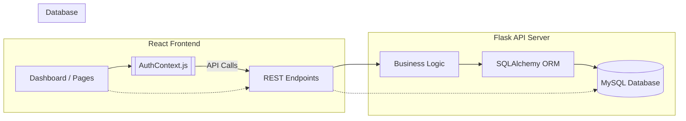
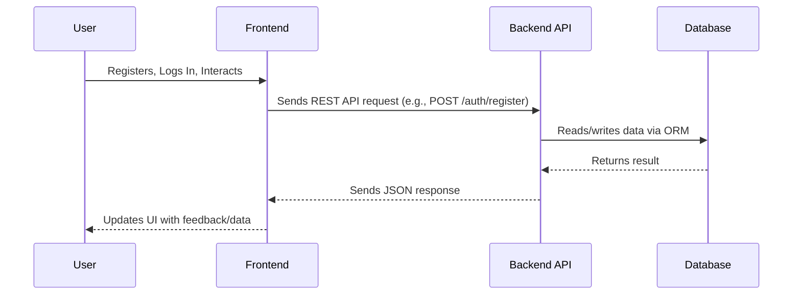

# ProNet Connect Architecture

## Overview

ProNet Connect is a web platform designed for professional networking, member management, and business referrals. The system is architected with a clear separation of concerns across **three main containers**:
- **Database Layer:** MySQL-based, for persistent storage of users, profiles, connections, referrals, meetings, and notifications.
- **Backend API:** Python Flask application providing RESTful endpoints for business logic, user authentication, and data management.
- **Frontend:** React web application that presents a user-friendly interface for all networking workflows.

---

## High-level System Diagram

---

## Container Descriptions

### 1. Database Layer (MySQL)
- **Purpose**: Stores all persistent application data.
- **Entities**: Users, Profiles, Connections, Referrals, Meetings, Notifications.
- **Schema**: Defined in SQL (`init_schema.sql`). Reflects a normalized relational structure.
- **Integration**: Accessed directly by backend via SQLAlchemy ORM.

### 2. Backend API (Flask)
- **Purpose**: Central business logic and API gateway.
- **Tech stack**: Python, Flask, Flask-Smorest, SQLAlchemy, JWT Authentication.
- **Responsibilities**:
    - User authentication and session management
    - CRUD operations for all entities
    - Access control and data validation
    - Notification delivery and aggregation
- **API**: RESTful endpoints, described below, are consumed by the frontend.

### 3. Frontend (React)
- **Purpose**: User interface for interaction with all platform features.
- **Key Components**:
    - Routing and Navigation (`App.js`, `Navbar.js`)
    - Authentication context for session handling
    - Pages for dashboard, members, profile, referrals, meetings, notifications
    - Forms, lists, and detail views
- **Integration**: All data/state operations are managed via REST API calls to the backend.

---

## Data Flow

---

## Authentication and Security

- **JWT-based authentication** (handled in backend; tokens stored in frontend context & localStorage)
- **Role-based permissions**: "member" and "admin".
- **API protected endpoints**: Only accessible with valid JWT.

---

## Dependencies

- **Frontend**: React, Axios, React Router
- **Backend**: Flask, Flask-Smorest, Flask-JWT-Extended, Flask-SQLAlchemy, PyMySQL, Marshmallow
- **Database**: MySQL
- **Other**: Express (database viewer utility, not production)

---

# Deployment & Environment

- All containers can be run independently for development via scripts.
- Environment variables required for DB connection, JWT secret (see container README/config for details).

---

# See Also
- [DESIGN.md](../pronet-connect-127616-127625/DESIGN.md) for component/UI and application flow details
- [PRD.md](../pronet-connect-127616-127626/PRD.md) for feature and requirement descriptions
